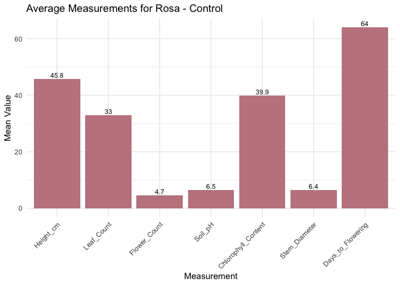
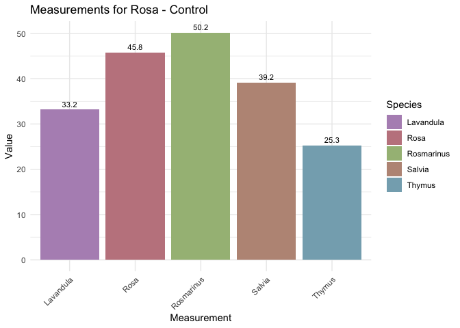
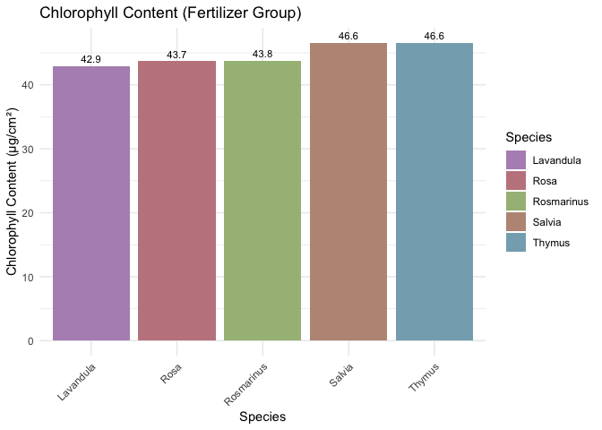
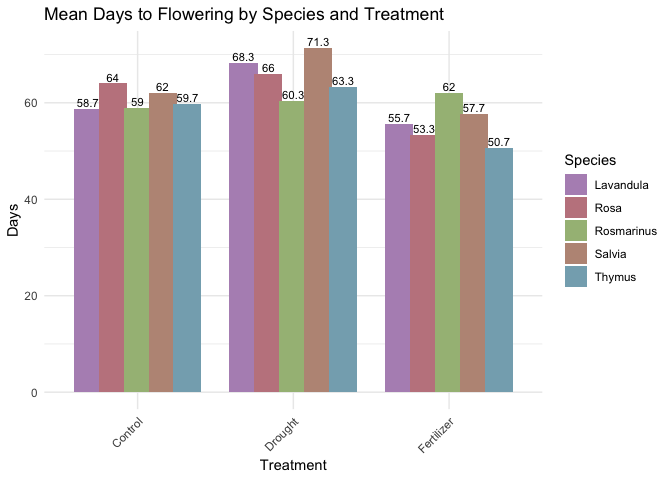

assignment
================
Thapanee Srirat
2025-05-04

``` r
plant_growth_data <- read.csv("plant_growth_data.csv")
```

``` r
head(plant_growth_data)
```

    ##   Plant_ID Species  Treatment Height_cm Leaf_Count Flower_Count Soil_pH
    ## 1        1    Rosa    Control      43.3         29            5     6.7
    ## 2        2    Rosa    Control      44.3         33            5     6.2
    ## 3        3    Rosa    Control      49.7         37            4     6.6
    ## 4        4    Rosa Fertilizer      53.2         46            6     7.2
    ## 5        5    Rosa Fertilizer      53.4         42            9     6.5
    ## 6        6    Rosa Fertilizer      58.1         48            6     6.9
    ##   Chlorophyll_Content Stem_Diameter Days_to_Flowering
    ## 1                36.8           6.6                64
    ## 2                43.8           5.9                65
    ## 3                39.0           6.7                63
    ## 4                42.4           8.9                48
    ## 5                44.3           7.0                59
    ## 6                44.4          10.7                53

``` r
library(dplyr)
```

    ## 
    ## Attaching package: 'dplyr'

    ## The following objects are masked from 'package:stats':
    ## 
    ##     filter, lag

    ## The following objects are masked from 'package:base':
    ## 
    ##     intersect, setdiff, setequal, union

``` r
library(ggplot2)
```

\#1.หาค่าเฉลี่ยของ Height_cm, Leaf_Count, Flower_Count, Soil_pH,
Chlorophyll_Content, Stem_Diameter และ Days_to_Flowering สำหรับแต่ละ
Species และ Treatment

``` r
#สร้าง dataframe จากไฟล์ csv โดยแบ่งกลุ่มตาม Species และ Treatment แล้วนำไปหาค่าเฉลี่ยต่างๆ
summary_df <- plant_growth_data %>% # %>% (pipe operator) ส่งข้อมูลไปยังคำสั่งถัดไป 
  group_by(Species, Treatment) %>% #จัดกลุ่มข้อมูลโดยใช้คอลัมน์ Species และ Treatment
  summarise(across(c(Height_cm, Leaf_Count, Flower_Count, Soil_pH, 
                     Chlorophyll_Content, Stem_Diameter, Days_to_Flowering),
                   mean, na.rm = TRUE, #ไม่เอาแถวที่เป็นNAมาคิดรวม
            .groups = "drop"  #ลบการจัดกลุ่มออกหลังสรุป
            ))
```

    ## Warning: There was 1 warning in `summarise()`.
    ## ℹ In argument: `across(...)`.
    ## ℹ In group 1: `Species = "Lavandula"` `Treatment = "Control"`.
    ## Caused by warning:
    ## ! The `...` argument of `across()` is deprecated as of dplyr 1.1.0.
    ## Supply arguments directly to `.fns` through an anonymous function instead.
    ## 
    ##   # Previously
    ##   across(a:b, mean, na.rm = TRUE)
    ## 
    ##   # Now
    ##   across(a:b, \(x) mean(x, na.rm = TRUE))

    ## `summarise()` has grouped output by 'Species'. You can override using the
    ## `.groups` argument.

\#2.สร้าง data frame ใหม่ที่ประกอบด้วย Species, Treatment
และค่าเฉลี่ยของพารามิเตอร์แต่ละตัว ใช้ head() เพื่อแสดง data frame ใหม่ของคุณ

``` r
#เรียกดูหัวตาราง6แถวแรก จากข้อที่1
head(summary_df)
```

    ## # A tibble: 6 × 9
    ## # Groups:   Species [2]
    ##   Species   Treatment  Height_cm Leaf_Count Flower_Count Soil_pH
    ##   <chr>     <chr>          <dbl>      <dbl>        <dbl>   <dbl>
    ## 1 Lavandula Control         33.2       26           9       6.27
    ## 2 Lavandula Drought         25.3       19.7         6.67    6.57
    ## 3 Lavandula Fertilizer      39.9       33.7        12.3     6.87
    ## 4 Rosa      Control         45.8       33           4.67    6.5 
    ## 5 Rosa      Drought         36.5       31.3         3.67    6.17
    ## 6 Rosa      Fertilizer      54.9       45.3         7       6.87
    ## # ℹ 3 more variables: Chlorophyll_Content <dbl>, Stem_Diameter <dbl>,
    ## #   Days_to_Flowering <dbl>

\#3.พล็อตกราฟแท่งของ Height_cm, Leaf_Count, Flower_Count, Soil_pH,
Chlorophyll_Content, Stem_Diameter และ Days_to_Flowering ใน Rosa/Control
(ใช้ค่าเฉลี่ยของแต่ละการวัด)

``` r
#สร้าง dataframe โดยกรองเฉพาะข้อมูลของ Rosa ที่เป็นกลุ่ม control
rosa_control <- filter(summary_df, Species == "Rosa" & Treatment == "Control")

#แปลงข้อมูลจาก wide เป็น long 
tmp <- stack(rosa_control[, 3:9])  # คอลัมน์ตัวเลขเท่านั้น
colnames(tmp) <- c("Mean", "Variable")

#สร้างกราฟเปรียบเทียบแต่ละค่าของ Rosa(control)
ggplot(tmp, aes(x = Variable, y = Mean)) +
  geom_bar(stat = "identity", fill = "#C2858E") +
  geom_text(aes(label = round(Mean, 1)), vjust = -0.3, size = 3) +
  theme_minimal() +
  labs(title = "Average Measurements for Rosa - Control",
       x = "Measurement",
       y = "Mean Value") +
  theme(axis.text.x = element_text(angle = 45, hjust = 1))
```

<!-- -->

\#4.เปรียบเทียบค่าเฉลี่ยของ Height_cm ระหว่าง Species ในกลุ่ม control
โดยใช้กราฟแท่ง

``` r
#สร้าง dataframe โดยกรองเฉพาะข้อมูลที่เป็นกลุ่ม control
control.df <- filter(summary_df, Treatment == "Control")

#สร้างกราฟเปรียบเทียบ height ของแต่ละสปีชีส์ในกลุ่ม control
ggplot(control.df, aes(x = control.df$Species, y = control.df$Height_cm, fill = Species)) +
  geom_bar(stat = "identity") +
  geom_text(aes(label = round(control.df$Height_cm, 1)), vjust = -0.5, size = 3) +
  labs(title = "Measurements for Rosa - Control",
       x = "Measurement",
       y = "Value") +
  theme_minimal() +
  theme(axis.text.x = element_text(angle = 45, hjust = 1)) +
    scale_fill_manual(values = c(
    "Lavandula" = "#B491BF",
    "Rosa" = "#C2858E",
    "Salvia" = "#BC9685",
    "Thymus" = "#85ADBC",
    "Rosmarinus" = "#A5BC85"
))
```

<!-- -->
\#5.เปรียบเทียบค่าเฉลี่ยของ Chlorophyll_Content ระหว่าง Species ในกลุ่ม
fertilizer โดยใช้กราฟแท่ง

``` r
#สร้าง dataframe โดยกรองเฉพาะข้อมูลที่เป็นกลุ่ม fertilizer
fertilizer.df <- filter(summary_df, Treatment == "Fertilizer")

#สร้างกราฟเปรียบเทียบ chlorophyll content ของแต่ละสปีชีส์ในกลุ่ม fertilizer
ggplot(fertilizer.df, aes(x = fertilizer.df$Species, y = fertilizer.df$Chlorophyll_Content, fill = Species)) +
  geom_bar(stat = "identity") +
  geom_text(aes(label = round(fertilizer.df$Chlorophyll_Content, 1)), vjust = -0.5, size = 3) +
  labs(title = "Chlorophyll Content (Fertilizer Group)",
       x = "Species",
       y = "Chlorophyll Content (μg/cm²)") +
  theme_minimal() +
  theme(axis.text.x = element_text(angle = 45, hjust = 1)) +
    scale_fill_manual(values = c( #กำหนดสีแต่ละสปีชีส์เอง
    "Lavandula" = "#B491BF",
    "Rosa" = "#C2858E",
    "Salvia" = "#BC9685",
    "Thymus" = "#85ADBC",
    "Rosmarinus" = "#A5BC85"
))
```

<!-- -->

\#6.เปรียบเทียบค่าเฉลี่ยของ Days_to_Flowering ของทุก Species และ Treatment
โดยใช้กราฟแท่ง

``` r
#สร้างกราฟโดยใช้ข้อมูลจาก dataframe ข้อที่1
days_to_flowering.df <- filter(summary_df, Treatment == "Fertilizer")
ggplot(summary_df, aes(x = Treatment, y = Days_to_Flowering, fill = Species)) +
  geom_bar(stat = "identity", position = position_dodge(width = 0.8)) +
  geom_text(aes(label = round(Days_to_Flowering, 1)),
            position = position_dodge(width = 0.8),
            vjust = -0.3, size = 3) +
  labs(title = "Mean Days to Flowering by Species and Treatment", y = "Days") +
  scale_fill_manual(values = c( #กำหนดสีแต่ละสปีชีส์เอง
    "Lavandula" = "#B491BF",
    "Rosa" = "#C2858E",
    "Salvia" = "#BC9685",
    "Thymus" = "#85ADBC",
    "Rosmarinus" = "#A5BC85"
  )) +
  theme_minimal() +
  theme(axis.text.x = element_text(angle = 45, hjust = 1))
```

<!-- -->
