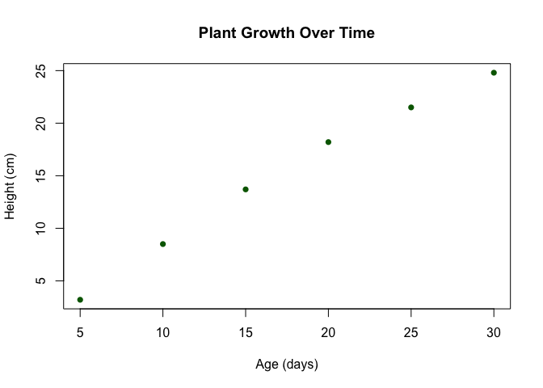
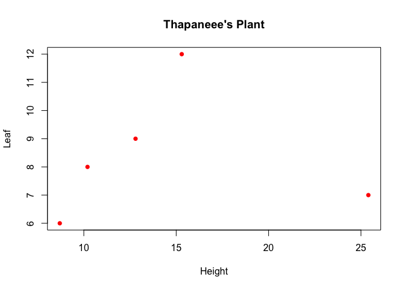
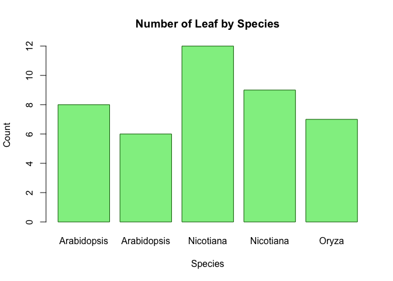
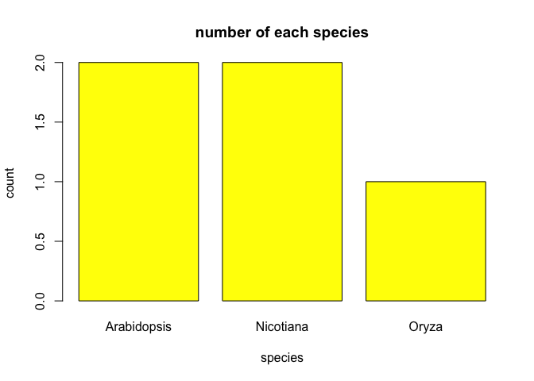
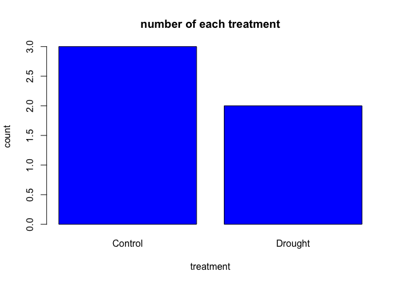

R_Markdown
================
Thapanee Srirat
2025-05-02

\#การคำนวณในR

``` r
1+1
```

    ## [1] 2

``` r
2*2
```

    ## [1] 4

``` r
16/2
```

    ## [1] 8

``` r
#Assign value to a variable
student_height <- 1.68
student_weight <- 79

#print the values
student_height
```

    ## [1] 1.68

``` r
student_weight
```

    ## [1] 79

``` r
student_weight/student_height^2
```

    ## [1] 27.99036

``` r
#เตย แหม่ม พี่ฝน
student_height <- c(1.68, 1.54, 1.63)
student_weight <- c(79, 39, 53)
```

``` r
#คำนวณBMI
student_weight/student_height^2
```

    ## [1] 27.99036 16.44459 19.94806

``` r
student_height_m <- c(1.70, 1.72, 1.65)

student_height_m + student_height
```

    ## [1] 3.38 3.26 3.28

``` r
student_height_m * 100
```

    ## [1] 170 172 165

``` r
#update variable
student_height_m <- student_height_m + 0.10
student_height_m
```

    ## [1] 1.80 1.82 1.75

``` r
class(student_height)
```

    ## [1] "numeric"

``` r
class(student_weight)
```

    ## [1] "numeric"

``` r
count <- 10L #assignจำนวนนับ
count
```

    ## [1] 10

``` r
class(count)
```

    ## [1] "integer"

``` r
count + 10
```

    ## [1] 20

``` r
count <- "10L" #ใส่ฟันหนูassignเป็นcharacter
count
```

    ## [1] "10L"

``` r
class(count)
```

    ## [1] "character"

``` r
#count + 10 #บวกไม่ได้เพราะไม่ได้เป็นตัวเลข
```

``` r
#logical(true/false)
is_flowering <- TRUE
class(is_flowering)
```

    ## [1] "logical"

\#การsubsetข้อมูลในvectorที่เป็นnumeric

``` r
#ใส่[]เพื่อเรียกข้อมูลที่ต้องการ
student_height
```

    ## [1] 1.68 1.54 1.63

``` r
student_height[2]
```

    ## [1] 1.54

``` r
#ใส่:(colon)เรียกข้อมูลหลายตำแหน่งที่ต้องการ
student_height[2:3]
```

    ## [1] 1.54 1.63

``` r
#ใช้cเรียกเฉพาะข้อมูลที่ต้องการ
student_height[c(1, 3)]
```

    ## [1] 1.68 1.63

``` r
# Create a vector of species names
species <- c("Arabidopsis", "Nicotiana", "Oryza", "Zea", "Solanum")
species
```

    ## [1] "Arabidopsis" "Nicotiana"   "Oryza"       "Zea"         "Solanum"

``` r
class(species)
```

    ## [1] "character"

\#ใช้กับcharacterได้ด้วย

``` r
species[4] #เอาเฉพาะ4ตัวเดียว
```

    ## [1] "Zea"

``` r
species[2:3] #เอาตั้งแต่2-3
```

    ## [1] "Nicotiana" "Oryza"

``` r
species[c(1,5)] #เอาเฉพาะ1กับ5
```

    ## [1] "Arabidopsis" "Solanum"

``` r
mean(student_height)
```

    ## [1] 1.616667

``` r
median(student_height)
```

    ## [1] 1.63

``` r
max(student_height)
```

    ## [1] 1.68

``` r
min(student_height)
```

    ## [1] 1.54

``` r
sum(student_height)
```

    ## [1] 4.85

``` r
length(student_height) #มีสมาชิกอยู่กี่ตัว
```

    ## [1] 3

``` r
#ถ้าจะใส่ตัวเลขเองต้องcombine
mean(c(150, 154, 160, 168))
```

    ## [1] 158

``` r
#สร้างfactorชุดข้อมูลจากvectorหลายๆชุด
treatments <- factor(c("Control", "Treatment A", "Treatment B", "Control", "Treatment A"))
treatments
```

    ## [1] Control     Treatment A Treatment B Control     Treatment A
    ## Levels: Control Treatment A Treatment B

``` r
levels(treatments) #treatmentมี5สมาชิก แต่แบ่งกลุ่มได้3ระดับ เช็คว่ามีกลุ่มอะไรบ้าง
```

    ## [1] "Control"     "Treatment A" "Treatment B"

``` r
table(treatments) #เช็คว่าแต่ละกลุ่มมีสมาชิกเท่าไหร่
```

    ## treatments
    ##     Control Treatment A Treatment B 
    ##           2           2           1

``` r
#ถ้าไม่ใส่factorจะเป็นการเก็บข้อมูลตัวอักษรเฉยๆ
treatments <- (c("Control", "Treatment A", "Treatment B", "Control", "Treatment A"))
treatments
```

    ## [1] "Control"     "Treatment A" "Treatment B" "Control"     "Treatment A"

``` r
grade_vector<- c("A", "B", "F", "F", "F", "C", "C")
grade_1 <- factor(grade_vector)
grade_1
```

    ## [1] A B F F F C C
    ## Levels: A B C F

``` r
grade_2 <- factor(grade_vector, levels = c("A", "B", "C", "D", "F"))
grade_1
```

    ## [1] A B F F F C C
    ## Levels: A B C F

``` r
grade_2
```

    ## [1] A B F F F C C
    ## Levels: A B C D F

``` r
# Create a data frame for an experiment สร้างdataframe(ตาราง)
experiment <- data.frame(
  Plant_ID = 1:5,
  Species = c("Arabidopsis", "Arabidopsis", "Nicotiana", "Nicotiana", "Oryza"),
  Treatment = c("Control", "Drought", "Control", "Drought", "Control"),
  Height = c(10.2, 8.7, 15.3, 12.8, 25.4),
  Leaf_Count = c(8, 6, 12, 9, 7)
)

# View the data frame
experiment
```

    ##   Plant_ID     Species Treatment Height Leaf_Count
    ## 1        1 Arabidopsis   Control   10.2          8
    ## 2        2 Arabidopsis   Drought    8.7          6
    ## 3        3   Nicotiana   Control   15.3         12
    ## 4        4   Nicotiana   Drought   12.8          9
    ## 5        5       Oryza   Control   25.4          7

``` r
# Create a data frame for an experiment สร้างdataframe(ตาราง)
Plant_ID = c(1,2,3,4,5)
Species = c("Arabidopsis", "Arabidopsis", "Nicotiana", "Nicotiana", "Oryza")
Treatment = c("Control", "Drought", "Control", "Drought", "Control")
Height = c(10.2, 8.7, 15.3, 12.8, 25.4)
Leaf_Count = c(8, 6, 12, 9, 7)
experiment <- data.frame(Plant_ID, Species, Treatment, Height, Leaf_Count)

# View the data frame
experiment
```

    ##   Plant_ID     Species Treatment Height Leaf_Count
    ## 1        1 Arabidopsis   Control   10.2          8
    ## 2        2 Arabidopsis   Drought    8.7          6
    ## 3        3   Nicotiana   Control   15.3         12
    ## 4        4   Nicotiana   Drought   12.8          9
    ## 5        5       Oryza   Control   25.4          7

``` r
experiment$Species #$เลือกคอลัมน์ในตารางมา ถ้าไม่ขึ้นcolumnให้เลือกให้กดtab
```

    ## [1] "Arabidopsis" "Arabidopsis" "Nicotiana"   "Nicotiana"   "Oryza"

``` r
experiment$Species[4] #$เลือกคอลัมน์ในตาราง เอาเฉพาะแถวที่4
```

    ## [1] "Nicotiana"

``` r
experiment$Species[3:4] #$เลือกคอลัมน์ในตาราง เอาเฉพาะแถวที่3-4
```

    ## [1] "Nicotiana" "Nicotiana"

``` r
#ถ้าอยากได้PlantID+2ให้เอาออกมาจากตารางก่อน
tmp=experiment$Plant_ID
tmp
```

    ## [1] 1 2 3 4 5

``` r
tmp=tmp+5
tmp
```

    ## [1]  6  7  8  9 10

``` r
experiment$Plant_ID=tmp #เปลี่ยนข้อมูลในตาราง

experiment
```

    ##   Plant_ID     Species Treatment Height Leaf_Count
    ## 1        6 Arabidopsis   Control   10.2          8
    ## 2        7 Arabidopsis   Drought    8.7          6
    ## 3        8   Nicotiana   Control   15.3         12
    ## 4        9   Nicotiana   Drought   12.8          9
    ## 5       10       Oryza   Control   25.4          7

``` r
experiment$Plant_ID=(c(1,2,3,4,5))
experiment
```

    ##   Plant_ID     Species Treatment Height Leaf_Count
    ## 1        1 Arabidopsis   Control   10.2          8
    ## 2        2 Arabidopsis   Drought    8.7          6
    ## 3        3   Nicotiana   Control   15.3         12
    ## 4        4   Nicotiana   Drought   12.8          9
    ## 5        5       Oryza   Control   25.4          7

``` r
#อยากshowเฉพาะcolumnหรือrowที่ต้องการ
#ข้างหน้าคือแถว ข้างหลังคือคอลัมน์ 
experiment[2,] #เอาเฉพาะrow2 ทุกcolumn
```

    ##   Plant_ID     Species Treatment Height Leaf_Count
    ## 2        2 Arabidopsis   Drought    8.7          6

``` r
experiment[2:4,] #เอาเฉพาะrow2-4 ทุกcolumn
```

    ##   Plant_ID     Species Treatment Height Leaf_Count
    ## 2        2 Arabidopsis   Drought    8.7          6
    ## 3        3   Nicotiana   Control   15.3         12
    ## 4        4   Nicotiana   Drought   12.8          9

``` r
experiment[,2:3] #เอาทุกrow column2-3
```

    ##       Species Treatment
    ## 1 Arabidopsis   Control
    ## 2 Arabidopsis   Drought
    ## 3   Nicotiana   Control
    ## 4   Nicotiana   Drought
    ## 5       Oryza   Control

``` r
experiment[2:4,2:3] #เอาrow2-4 column2-3
```

    ##       Species Treatment
    ## 2 Arabidopsis   Drought
    ## 3   Nicotiana   Control
    ## 4   Nicotiana   Drought

``` r
summary(experiment) #ดูข้อมูลเบื้องต้น
```

    ##     Plant_ID   Species           Treatment             Height     
    ##  Min.   :1   Length:5           Length:5           Min.   : 8.70  
    ##  1st Qu.:2   Class :character   Class :character   1st Qu.:10.20  
    ##  Median :3   Mode  :character   Mode  :character   Median :12.80  
    ##  Mean   :3                                         Mean   :14.48  
    ##  3rd Qu.:4                                         3rd Qu.:15.30  
    ##  Max.   :5                                         Max.   :25.40  
    ##    Leaf_Count  
    ##  Min.   : 6.0  
    ##  1st Qu.: 7.0  
    ##  Median : 8.0  
    ##  Mean   : 8.4  
    ##  3rd Qu.: 9.0  
    ##  Max.   :12.0

\#subsetข้อมูลโดยใช้ชื่อcolumn

``` r
experiment[1:3, c("Species", "Height")]
```

    ##       Species Height
    ## 1 Arabidopsis   10.2
    ## 2 Arabidopsis    8.7
    ## 3   Nicotiana   15.3

\#list

``` r
# Create a list containing different types of data
plant_data <- list( #4อันแรกเป็นvector อันสุดท้ายเป็นตาราง
  id = "AT001",
  species = "Arabidopsis thaliana",
  heights = c(10.2, 11.5, 9.8),
  is_model_organism = TRUE,
  germination_rates = data.frame(
    temperature = c(20, 25, 30),
    rate = c(0.82, 0.95, 0.78)
  )
)
plant_data
```

    ## $id
    ## [1] "AT001"
    ## 
    ## $species
    ## [1] "Arabidopsis thaliana"
    ## 
    ## $heights
    ## [1] 10.2 11.5  9.8
    ## 
    ## $is_model_organism
    ## [1] TRUE
    ## 
    ## $germination_rates
    ##   temperature rate
    ## 1          20 0.82
    ## 2          25 0.95
    ## 3          30 0.78

``` r
# Access list elements
plant_data$species
```

    ## [1] "Arabidopsis thaliana"

``` r
# Create a list containing different types of data
id = "AT001"
species = "Arabidopsis thaliana"
heights = c(10.2, 11.5, 9.8)
is_model_organism = TRUE

temperature = c(20, 25, 30)
rate = c(0.82, 0.95, 0.78)
germination_rates = data.frame(temperature, rate)

plant_data <- list(id_1 = id, #ตั้งชื่อให้แต่ละตัวเช่นชื่อid_1บรรจุข้อมูลid
                   species_1 = species,
                   heights_1 = heights, 
                   is_model_organism_1 = is_model_organism, 
                   germination_rates_1 = germination_rates
                   )
plant_data
```

    ## $id_1
    ## [1] "AT001"
    ## 
    ## $species_1
    ## [1] "Arabidopsis thaliana"
    ## 
    ## $heights_1
    ## [1] 10.2 11.5  9.8
    ## 
    ## $is_model_organism_1
    ## [1] TRUE
    ## 
    ## $germination_rates_1
    ##   temperature rate
    ## 1          20 0.82
    ## 2          25 0.95
    ## 3          30 0.78

``` r
plant_data$species_1 #ดึงข้อมูลที่เราต้องการออกมา$
```

    ## [1] "Arabidopsis thaliana"

``` r
plant_data$heights_1
```

    ## [1] 10.2 11.5  9.8

\#Scatter Plot

``` r
# Create some data
plant_age <- c(5, 10, 15, 20, 25, 30)
plant_size <- c(3.2, 8.5, 13.7, 18.2, 21.5, 24.8)

# Create a basic scatter plot
plot(plant_age, plant_size, #ใส่vectorแกนxและแกนy
     main = "Plant Growth Over Time", #ชื่อกราฟ
     xlab = "Age (days)", # แกนx label
     ylab = "Height (cm)", #แกน y label
     col = "darkgreen", #color
     pch = 16)  # pch controls the point shape
```

<!-- -->

``` r
plot(experiment$Height, experiment$Leaf_Count,
     main = "Thapaneee's Plant",
     xlab = "Height",
     ylab = "Leaf",
     col = "red",
     pch = 16)
```

<!-- -->
\#Bar Plots

``` r
# Create data for a bar plot
species_counts <- c(15, 23, 8, 12)
species_names <- c("Arabidopsis", "Nicotiana", "Oryza", "Zea")

# Create a bar plot #มีdimensionเดียว
barplot(experiment$Leaf_Count,
        names.arg = experiment$Species,
        main = "Number of Leaf by Species",
        xlab = "Species",
        ylab = "Count",
        col = "lightgreen",
        border = "darkgreen")
```

<!-- -->

``` r
#tableนับจำนวนข้อมูลที่ซ้ำกันในvector
tmp <- table(experiment$Species)
tmp
```

    ## 
    ## Arabidopsis   Nicotiana       Oryza 
    ##           2           2           1

``` r
names(tmp)
```

    ## [1] "Arabidopsis" "Nicotiana"   "Oryza"

``` r
barplot(tmp,
        names.arg = names(tmp),
        main = "number of each species",
        xlab = "species",
        ylab = "count",
        col = 'yellow')
```

<!-- -->

``` r
tmp <- table(experiment$Treatment)
tmp
```

    ## 
    ## Control Drought 
    ##       3       2

``` r
names(tmp)
```

    ## [1] "Control" "Drought"

``` r
barplot(tmp,
        names.arg = names(tmp),
        main = "number of each treatment",
        xlab = "treatment",
        ylab = "count",
        col = 'blue')
```

<!-- -->
\#Box Plots แกนxเป็นcharater แกนyเป็นข้อมูลภาพรวม

``` r
# Create some data
treatment_A <- c(12.3, 14.5, 13.8, 15.2, 11.9, 13.7)
treatment_B <- c(15.8, 16.2, 14.9, 17.3, 16.5, 15.9)
treatment_C <- c(10.2, 11.5, 9.8, 10.5, 12.1, 11.3)

# Combine data for boxplot เอาข้อมูลvectorมาใส่ในlist ตั้งชื่อให้ ทำข้อมูลเป็นlist(all data)
all_data <- list(
  "Control" = treatment_A,
  "Fertilizer" = treatment_B,
  "Drought" = treatment_C
)
# Create a boxplot
boxplot(all_data,
        main = "Plant Heights by Treatment",
        ylab = "Height (cm)",
        col = c("lightblue", "lightgreen", "salmon"))
```

<!-- -->

``` r
#ทำเป็นตารางแทนlist
dat2 <- data.frame(Control = treatment_A,
                   Fertilizer = treatment_B,
                   Drought = treatment_C
                   )
boxplot(dat2,
        main = "Plant Heights by Treatment",
        ylab = "Height (cm)",
        col = c("lightblue", "lightgreen", "salmon"))
```

\#T-Test

``` r
# Create two groups for comparison
#control <- c(5.2, 5.5, 5.0, 5.8, 5.3, 5.1, 5.6)
#treatment <- c(6.5, 6.2, 6.8, 6.1, 6.7, 6.3, 6.5)
dat2
```

    ##   Control Fertilizer Drought
    ## 1    12.3       15.8    10.2
    ## 2    14.5       16.2    11.5
    ## 3    13.8       14.9     9.8
    ## 4    15.2       17.3    10.5
    ## 5    11.9       16.5    12.1
    ## 6    13.7       15.9    11.3

``` r
# Perform a t-test
t_test_result <- t.test(dat2$Fertilizer, dat2$Control) #เอาข้อมูลเดิมdat2มาใช้

# View the result
t_test_result
```

    ## 
    ##  Welch Two Sample t-test
    ## 
    ## data:  dat2$Fertilizer and dat2$Control
    ## t = 4.1511, df = 8.4347, p-value = 0.002855
    ## alternative hypothesis: true difference in means is not equal to 0
    ## 95 percent confidence interval:
    ##  1.138545 3.928121
    ## sample estimates:
    ## mean of x mean of y 
    ##  16.10000  13.56667

\#ANOVA

``` r
# Combine data into a single data frame
dat2
```

    ##   Control Fertilizer Drought
    ## 1    12.3       15.8    10.2
    ## 2    14.5       16.2    11.5
    ## 3    13.8       14.9     9.8
    ## 4    15.2       17.3    10.5
    ## 5    11.9       16.5    12.1
    ## 6    13.7       15.9    11.3

``` r
#สร้างตารางใหม่เพื่อANOVA

plant_growth <- data.frame(
  Height = c(dat2$Control, dat2$Fertilizer, dat2$Drought), #เอาข้อมูลแต่ละคอลัมน์มาต่อกัน
  Treatment = factor(rep(c("Control", "Fertilizer", "Drought"), each = 6)) #rep=repeatซ้ำชื่อละ6each6
)
plant_growth
```

    ##    Height  Treatment
    ## 1    12.3    Control
    ## 2    14.5    Control
    ## 3    13.8    Control
    ## 4    15.2    Control
    ## 5    11.9    Control
    ## 6    13.7    Control
    ## 7    15.8 Fertilizer
    ## 8    16.2 Fertilizer
    ## 9    14.9 Fertilizer
    ## 10   17.3 Fertilizer
    ## 11   16.5 Fertilizer
    ## 12   15.9 Fertilizer
    ## 13   10.2    Drought
    ## 14   11.5    Drought
    ## 15    9.8    Drought
    ## 16   10.5    Drought
    ## 17   12.1    Drought
    ## 18   11.3    Drought

``` r
#เช็คfactor
class(plant_growth$Treatment) #factor
```

    ## [1] "factor"

``` r
class(plant_growth$Height) #numeric
```

    ## [1] "numeric"

``` r
#y=ax+bสมการเส้นตรง
# Perform one-way ANOVA
anova_result <- aov(Height ~ Treatment, data = plant_growth)

# Summary of the ANOVA results
summary(anova_result)
```

    ##             Df Sum Sq Mean Sq F value   Pr(>F)    
    ## Treatment    2  81.14   40.57   40.59 8.87e-07 ***
    ## Residuals   15  14.99    1.00                     
    ## ---
    ## Signif. codes:  0 '***' 0.001 '**' 0.01 '*' 0.05 '.' 0.1 ' ' 1

``` r
# If the ANOVA is significant, perform post-hoc test to find which groups differ
# Tukey's Honest Significant Difference test
tukey_result <- TukeyHSD(anova_result)
tukey_result
```

    ##   Tukey multiple comparisons of means
    ##     95% family-wise confidence level
    ## 
    ## Fit: aov(formula = Height ~ Treatment, data = plant_growth)
    ## 
    ## $Treatment
    ##                         diff       lwr       upr     p adj
    ## Drought-Control    -2.666667 -4.165984 -1.167350 0.0009157
    ## Fertilizer-Control  2.533333  1.034016  4.032650 0.0014425
    ## Fertilizer-Drought  5.200000  3.700683  6.699317 0.0000006
